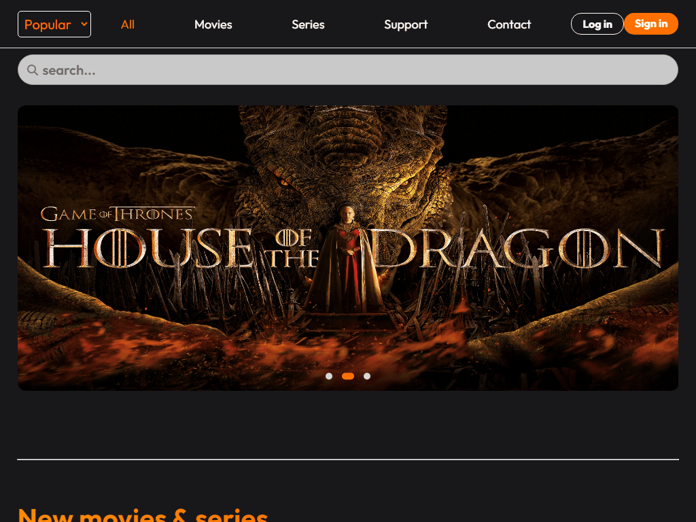
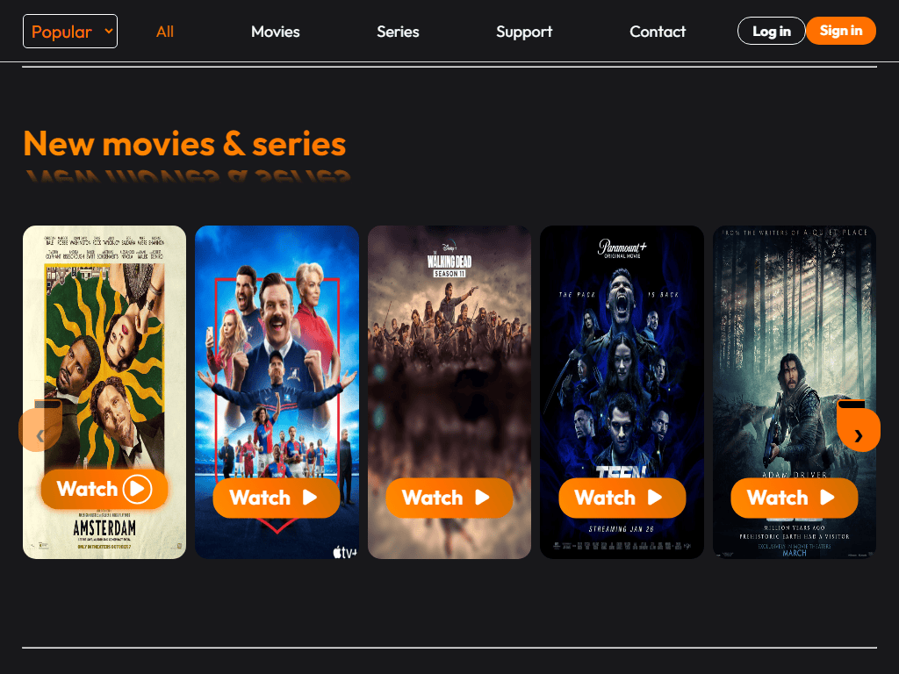
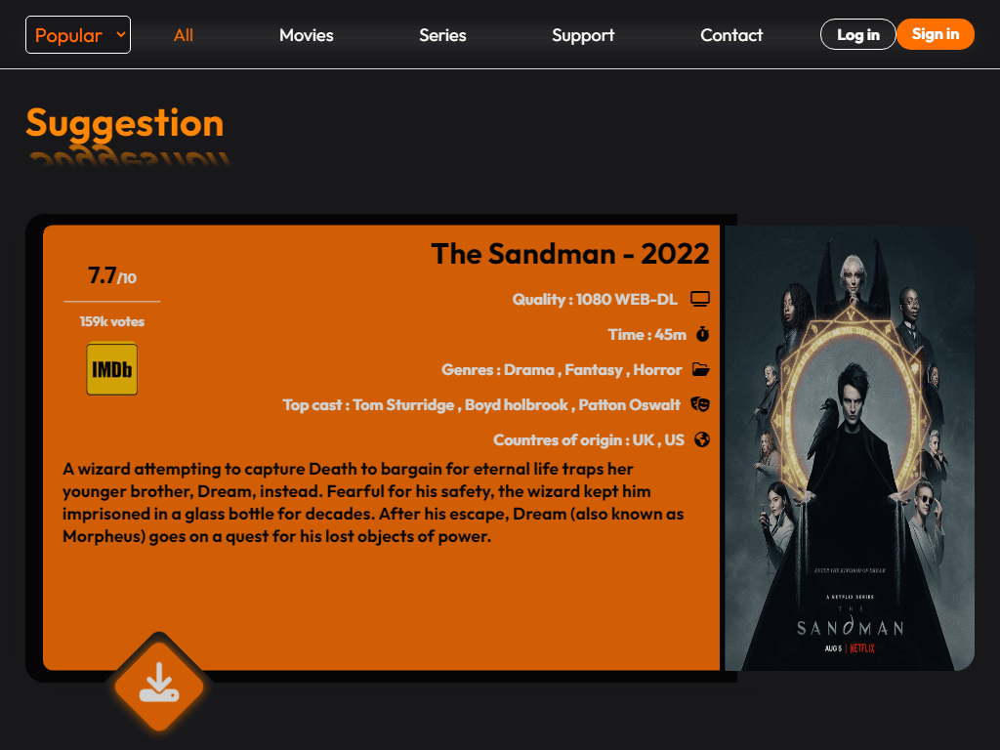
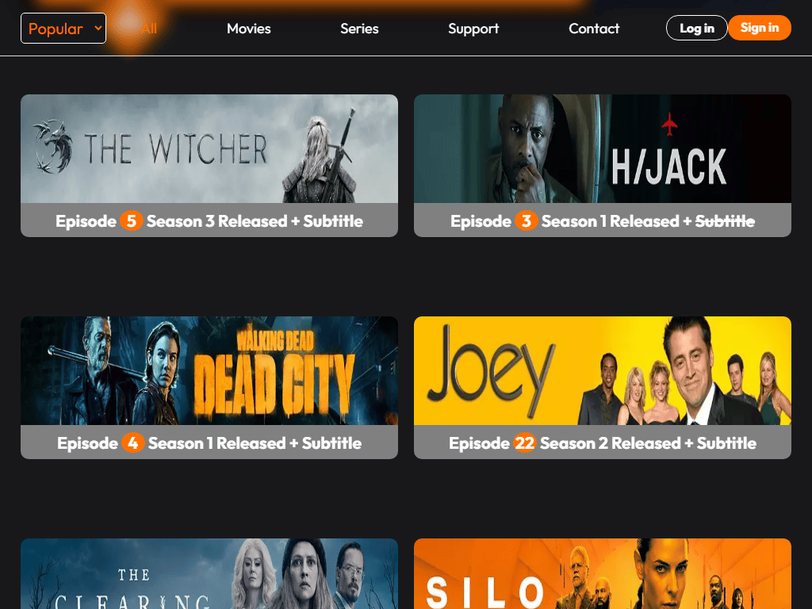
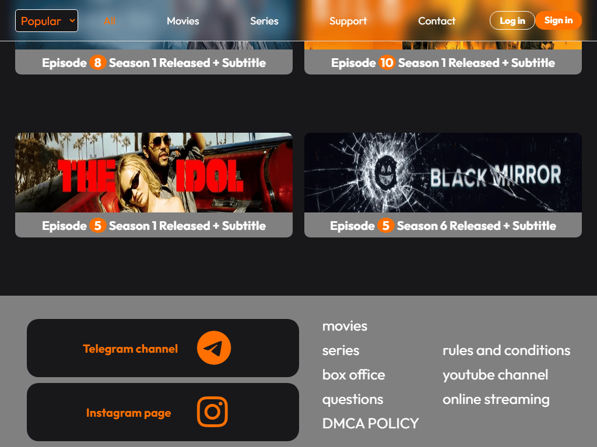
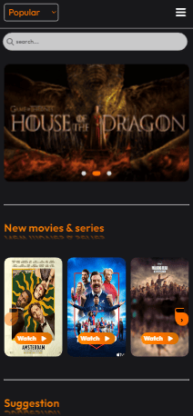

# 🎥 Movie website

### this is the first site i've Created ! it's totally Responsive on all devices. also this is an static site. the point of creating this site was improving my html, css and JS Skills.

## Link 🔗 [https://charactermi.github.io/movies](https://charactermi.github.io/movies)

 

# Preview

# Mobile Responsive

# Technologies

<ul>
    <li>
        
    </li>
    <li>
        
    </li>
    <li>
        
    </li>
</ul>